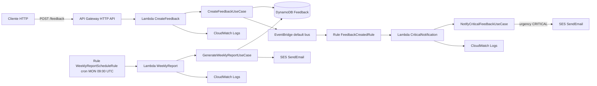

# fiap-techchallenge-4

## Objetivo

Implementar uma API serverless para registro e tratamento de feedbacks, com arquitetura hexagonal simplificada, usando Java 21, Quarkus, AWS Lambda e AWS SAM.

## Arquitetura

Padrao Ports and Adapters (Clean Architecture simplificada):

- Domain: entidades, enums e value objects.
- Application: casos de uso e portas de entrada/saida.
- Adapters Inbound: handlers Lambda que recebem eventos e delegam para casos de uso.
- Adapters Outbound: integracoes com DynamoDB, EventBridge e SES via ports.
- Config: composicao dos casos de uso com adapters.

## Diagrama Mermaid



## Estrutura

- src/main/java/br/com/fiap/techchallenge4/domain
- src/main/java/br/com/fiap/techchallenge4/application
- src/main/java/br/com/fiap/techchallenge4/adapters/inbound
- src/main/java/br/com/fiap/techchallenge4/adapters/outbound
- src/main/java/br/com/fiap/techchallenge4/config
- template.yaml
- .github/workflows/deploy.yml

## Tecnologias

- Java 21
- Quarkus
- Maven
- AWS Lambda
- AWS SAM
- API Gateway HTTP API
- DynamoDB
- EventBridge
- SES
- GitHub Actions

## Como executar

Pre-requisitos:

- Java 21
- Maven 3.9+
- AWS SAM CLI
- AWS CLI configurado

Comandos:

```bash
mvn clean verify
mvn package
ls target/function.zip
sam local start-api
```

API local:

- POST <http://127.0.0.1:3000/feedback>

Para execução com Postman:

1. Importe a collection [postman/fiap-techchallenge-4.postman_collection.json](postman/fiap-techchallenge-4.postman_collection.json) e o environment [postman/fiap-techchallenge-4.postman_environment.json](postman/fiap-techchallenge-4.postman_environment.json).
2. Selecione o environment `fiap-techchallenge-4`.
3. Para uso local, mantenha `baseUrl` apontando para `http://127.0.0.1:3000`.
4. Suba a API local com `sam local start-api --template template.yaml`.
5. Execute primeiro o request `Healthcheck` e depois o request `Create feedback`.
6. Para demonstrar a stack na AWS, troque `baseUrl` para `https://<HttpApiEndpoint>` e rode os mesmos requests novamente.
7. Se quiser alternar rapido entre local e AWS, edite apenas o valor da variavel `baseUrl` no environment importado.

Exemplo de payload:

```json
{
  "content": "Excelente atendimento",
  "urgency": "MEDIUM"
}
```

## Como fazer deploy

Manual:

```bash
mvn clean package
sam deploy \
  --template-file template.yaml \
  --stack-name fiap-techchallenge-4 \
  --region us-east-1 \
  --capabilities CAPABILITY_IAM \
  --resolve-s3 \
  --parameter-overrides SesFromEmail=seu-email@dominio.com SesToEmail=destino@dominio.com \
  --no-confirm-changeset \
  --no-fail-on-empty-changeset
```

GitHub Actions:

- Workflow: .github/workflows/deploy.yml
- Secrets esperados:
- AWS_ACCESS_KEY_ID
- AWS_SECRET_ACCESS_KEY
- AWS_REGION
- SES_FROM_EMAIL
- SES_TO_EMAIL

Pre-requisito para envio de e-mail:

- Verificar as identidades de remetente e destinatario no SES da mesma regiao do deploy.

## Como testar

Testes automatizados:

```bash
mvn test
```

Teste da API local:

```bash
sam local start-api --template template.yaml
```

Enviar requisicao POST para /feedback.

## Monitoramento

- CloudWatch Logs por Lambda:
- /aws/lambda/CreateFeedback
- /aws/lambda/CriticalNotification
- /aws/lambda/WeeklyReport
- CloudWatch Metrics de Lambda, API Gateway e EventBridge.

## Lambdas

- CreateFeedback: recebe feedback via HTTP, cria registro e publica evento FeedbackCreated.
- CriticalNotification: processa evento FeedbackCreated e notifica quando urgencia for CRITICAL.
- WeeklyReport: executa semanalmente e gera relatorio agregado.

## Banco

- DynamoDB
- Tabela: Feedback
- Chave primaria: feedbackId (String)
- Billing mode: PAY_PER_REQUEST

## API

- Tipo: API Gateway HTTP API
- Endpoint principal: POST /feedback
- Contrato de entrada:
- content: string
- urgency: LOW | MEDIUM | HIGH | CRITICAL

## Fluxo

1. Cliente envia POST /feedback.
2. CreateFeedbackHandler delega para CreateFeedbackUseCase.
3. Caso de uso persiste no DynamoDB e publica FeedbackCreated no EventBridge.
4. Rule FeedbackCreated aciona CriticalNotification Lambda.
5. Use case notifica via SES apenas para CRITICAL.
6. Schedule semanal aciona WeeklyReport Lambda.
7. Use case agrega dados e envia relatorio via SES.

## Limitacoes

- Sem autenticacao/autorizacao na API.
- Sem paginacao e sem consultas avancadas de feedback.
- findBetween usa Scan no DynamoDB (adequado para escopo academico, nao otimizado para alto volume).
- Sem DLQ, retry policy customizada e alarmes detalhados.
- Sem testes de integracao com servicos AWS reais.

## Validacao pos-deploy

```bash
# 1. Stack criada
aws cloudformation describe-stacks --stack-name fiap-techchallenge-4

# 2. Outputs
aws cloudformation describe-stacks --stack-name fiap-techchallenge-4 \
  --query "Stacks[0].Outputs"

# 3. Lambdas
aws lambda list-functions --query "Functions[?contains(FunctionName,'fiap-techchallenge-4')].FunctionName"

# 4. DynamoDB
aws dynamodb describe-table --table-name Feedback

# 5. EventBridge
aws events list-rules --name-prefix Feedback
aws events list-rules --name-prefix WeeklyReport

# 6. Log groups
aws logs describe-log-groups --log-group-name-prefix /aws/lambda/

# 7. Smoke test API
curl -X POST https://<HttpApiEndpoint>/feedback \
  -H "Content-Type: application/json" \
  -d '{"content":"Teste deploy","urgency":"CRITICAL"}'
```
