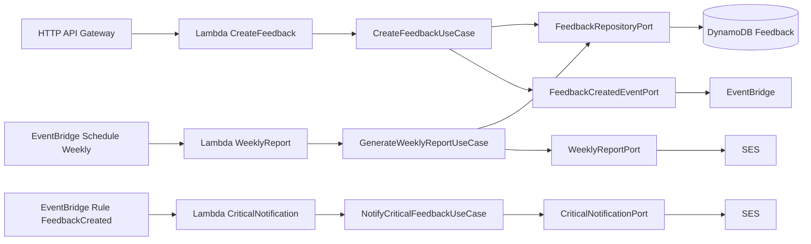

# fiap-techchallenge-4

## Objetivo

Implementar uma API serverless para registro e tratamento de feedbacks, com arquitetura hexagonal simplificada, usando Java 21, Quarkus, AWS Lambda e AWS SAM.

## Arquitetura

Padrão Ports and Adapters (Clean Architecture simplificada):

- Domain: entidades, enums e value objects.
- Application: casos de uso e portas de entrada/saída.
- Adapters Inbound: handlers Lambda que recebem eventos e delegam para casos de uso.
- Adapters Outbound: integrações com DynamoDB, EventBridge e SES via ports.
- Config: composição dos casos de uso com adapters.

## Diagrama Mermaid



## Estrutura

- src/main/java/br/com/fiap/techchallenge4/domain
- src/main/java/br/com/fiap/techchallenge4/application
- src/main/java/br/com/fiap/techchallenge4/adapters/inbound
- src/main/java/br/com/fiap/techchallenge4/adapters/outbound
- src/main/java/br/com/fiap/techchallenge4/config
- template.yaml
- .github/workflows/ci-cd-sam.yml

## Tecnologias

- Java 21
- Quarkus
- Maven
- AWS Lambda
- AWS SAM
- API Gateway HTTP API
- DynamoDB
- EventBridge
- SES
- GitHub Actions

## Como executar

Pré-requisitos:

- Java 21
- Maven 3.9+
- AWS SAM CLI
- AWS CLI configurado

Comandos:

```bash
mvn clean test
sam build --template-file template.yaml
sam local start-api
```

API local:

- POST http://127.0.0.1:3000/feedback

Exemplo de payload:

```json
{
	"content": "Excelente atendimento",
	"urgency": "MEDIUM"
}
```

## Como fazer deploy

Manual:

```bash
sam build --template-file template.yaml
sam deploy \
	--stack-name fiap-techchallenge-4 \
	--region us-east-1 \
	--capabilities CAPABILITY_IAM \
	--no-confirm-changeset \
	--no-fail-on-empty-changeset
```

GitHub Actions:

- Workflow: .github/workflows/ci-cd-sam.yml
- Secrets esperados:
- AWS_ACCESS_KEY_ID
- AWS_SECRET_ACCESS_KEY
- AWS_REGION
- SAM_STACK_NAME

## Como testar

Testes automatizados:

```bash
mvn test
```

Teste da API local:

```bash
sam local start-api
```

Enviar requisição POST para /feedback.

## Monitoramento

- CloudWatch Logs por Lambda:
- /aws/lambda/CreateFeedback
- /aws/lambda/CriticalNotification
- /aws/lambda/WeeklyReport
- CloudWatch Metrics de Lambda, API Gateway e EventBridge.

## Lambdas

- CreateFeedback: recebe feedback via HTTP, cria registro e publica evento FeedbackCreated.
- CriticalNotification: processa evento FeedbackCreated e notifica quando urgência for CRITICAL.
- WeeklyReport: executa semanalmente e gera relatório agregado.

## Banco

- DynamoDB
- Tabela: Feedback
- Chave primária: feedbackId (String)
- Billing mode: PAY_PER_REQUEST

## API

- Tipo: API Gateway HTTP API
- Endpoint principal: POST /feedback
- Contrato de entrada:
- content: string
- urgency: LOW | MEDIUM | HIGH | CRITICAL

## Fluxo

1. Cliente envia POST /feedback.
2. CreateFeedbackHandler delega para CreateFeedbackUseCase.
3. Caso de uso persiste no DynamoDB e publica FeedbackCreated no EventBridge.
4. Rule FeedbackCreated aciona CriticalNotification Lambda.
5. Use case notifica via SES apenas para CRITICAL.
6. Schedule semanal aciona WeeklyReport Lambda.
7. Use case agrega dados e envia relatório via SES.

## Limitações

- Sem autenticação/autorização na API.
- Sem paginação e sem consultas avançadas de feedback.
- findBetween usa Scan no DynamoDB (adequado para escopo acadêmico, não otimizado para alto volume).
- Sem DLQ, retry policy customizada e alarmes detalhados.
- Sem testes de integração com serviços AWS reais.